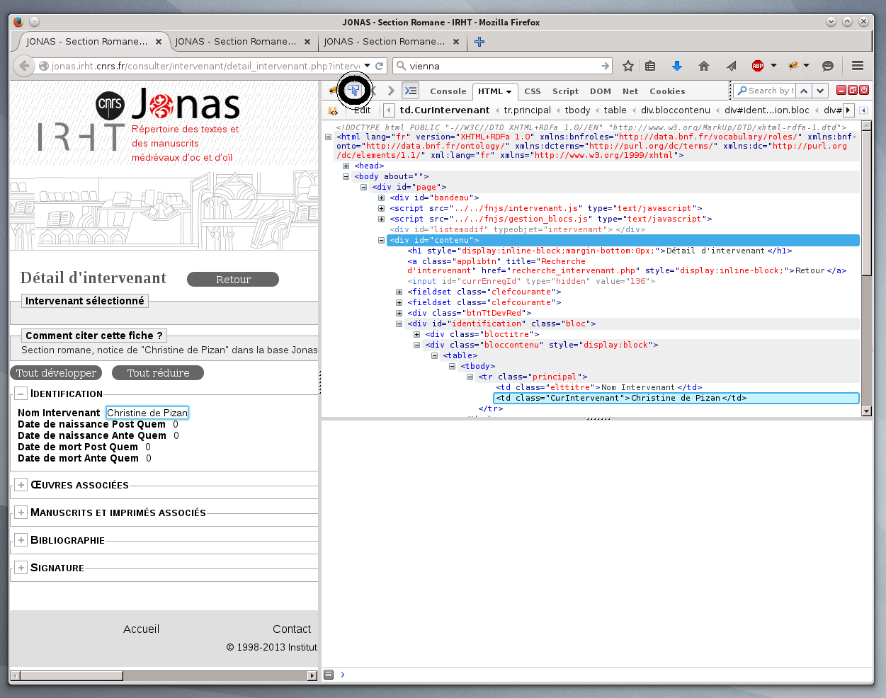
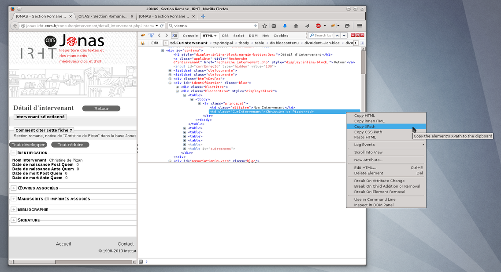
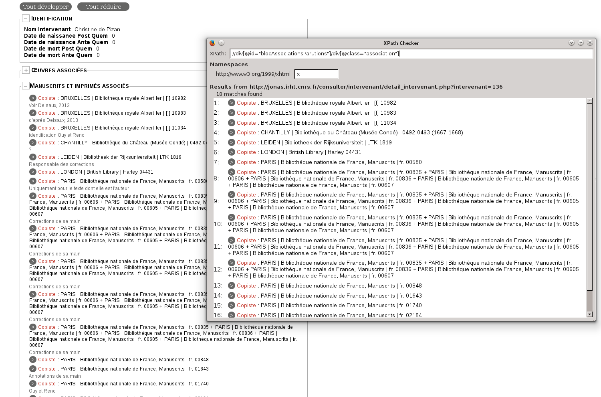

# Portia

This project is very young and still heavily under development. There were several issues when we wanted to try it on Jonas or Mirabile. First of all, it doesn't support text nodes. For example on a mirabile page the code looks like this:
```html
<a class="linkScheda" target="_blank"
href="/manuscript/eichst%C3%A4tt-universit%C3%A4tsbibliothek-(olim-staatliche--manuscript/12811"
title="Eichstätt, Universitätsbibliothek (olim Staatliche und Seminarbibliothek), st 687"
xmlns:fo="http://www.w3.org/1999/XSL/Format">
Eichstätt, Universitätsbibliothek (olim Staatliche und Seminarbibliothek), st 687
</a>
II, ff. 16-27, f. 21r
<br xmlns:fo="http://www.w3.org/1999/XSL/Format"><i>autographus</i>
```
and it is impossible in Portia to capture ```II, ff. 16-27, f. 21r```.

Another problem appeared in Jonas, where it wasn't possible to annotate hidden fields at all. The desired data are part of the webpage, but are hidden and appear only after clicking a Javascript button and this interferes with Portia's annotate feature.

Ultimately, result of Portia annotation is a Scrapy spider which is created according to a template found in ```slyd/slyd/projecttemplates.py``` in the Portia directory. So it is easy to modify Portia to produce Spiders which use our custom middleware that extends Spiders with automatic addition of full html source, timestamp etc.


# Hand-made spiders

Hand-made spiders use mainly XPath or CSS selectors (see [Scrapy documentation](http://doc.scrapy.org/en/latest/topics/selectors.html) for details) to extract the data. It is usually necessary to combine these selectors with some Python code. Quality of html code of the source page and variability of source pages of certain given type are the biggest factor here. From this point of view, Mirabile title pages were quite a challenge since there are no classes or ids in the code which is highly irregular. For example it is not easy to tell where shelfmarks stop and notes begin.

The general strategy here is to extract as much as possible using XPaths and then deal with the rest with a combination regular expressions and Python code. The Jonas code was more amenable to this approach and all three spiders for Jonas took less time to make than the one for Mirabile. It is also possible -- and sometimes necessary -- to parse the HTML code in a more pedestrian way, see mirabile-title spider. To create appropriate XPaths the following two Firefox extensions are very helpful: [Firebug](http://getfirebug.com/) and [XPath checker](https://code.google.com/p/xpathchecker/).

The Firebug "copy XPath" function is good for quickly getting XPath to elements without class or id which are on all webpages in the same position in the DOM tree. First one left-clicks on inspect element (circled in the first screenshot) and then on the part of the webpage where the data are. Right click on the corresponding source code line brings a context menu where one can copy the XPath to this element. Please beware that Firefox adds ```tbody``` tag into the tables so it is sometimes necessary to delete it from the XPath.




One can test the XPath directly in Firefox using the XPath checker extension. This extension is brought up by clicking ```View XPath``` in the right-click context menu of a webpage.



Once the data are extracted from the webpage via XPath or CSS selectors it is usually necessary process it further before sending it to the client. Since spiders are really Python classes one can use Python code and libraries for this purpose. See e.g. jonas spiders where we use regular expressions to extract data out of an unstructured text. All spiders must store the data in a class derived from ```scrapy.Item``` and one can create a hierarchy of classes for scraping of more complicated sites (see ```jonas/items.py```). Moreover, one can assign arbitrary metadata to each item field, and use them later in an ItemPipeline. There are several special names reserved for item loaders the most important of which are ```input_processor``` and ```output_processor```. One can assign functions to these names that serve to process data passed to and out of the item field. A noteworthy example is ```oeuvres_title``` and ```incipit``` fields of the jonas-author spider. If one uses XPath that ends with ```text()``` node, the resulting scraped datasets are of the wrong length and cannot be paired, since some of the works may not contain the title. The solution is to use ```extract_text``` function as the input processor. See [Item loaders](http://doc.scrapy.org/en/latest/topics/loaders.html) in the official Scrapy documentation for more details and ```jonas/items.py``` for more examples. 

For testing the XPath from within the Scrapy framework and for developing the Python code to "massage" the data further, one can run in a terminal window ```scrapy shell URL``` which brings up a python console with objects that are handed to a spider during webscraping, i.e. mainly the response object that contains the response from the webpage and xpath selector. To test the spiders it is possible to run them via ```scrapy crawl spider-name``` inside the project directory.

